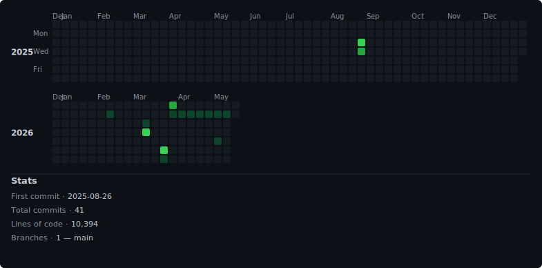

# layoutlens

Tauri desktop app + Hono microservice for inspecting how websites lay out across breakpoints / locales — pulls a sitemap, renders pages, captures screenshots into a gallery for design review.

🌐 Tauri app (distributed as a binary). Microservice runs alongside.



## What it is

The desktop app drives the workflow: sitemap discovery (give it a domain, it returns a list of URLs), then headless rendering at the breakpoints / locales you care about, with the resulting screenshots collated into a gallery you can scroll through. Useful for design QA and pre-launch checks. The Hono microservice handles the heavy work (sitemap fetching, page imports) so the Tauri side stays light.

## Stack

- **Tauri** desktop shell
- **SvelteKit** for the UI (loads inside Tauri)
- **Hono** microservice for sitemap / rendering jobs
- **Bun** as runtime + package manager

## Quick start

```bash
bun install

# Web UI dev (no native shell)
bun run dev

# Tauri dev (full desktop app)
bun run tauri:dev

# Microservice
bun run microservice:dev
```

```bash
bun run tauri:build               # build the Tauri app binary
bun run microservice:typecheck    # type-check the microservice
```
